#  &nbsp;SafeHouse

A Safehouse é uma plataforma para jogadores se encontrar e poderem jogar online de forma segura em um ambiente agradável e tranquilo.

## 📜 Sobre

É muito comum em partidas online nós encontrarmos jogadores que nos xingam, usam hack ou atrapalham a partida de alguma, assim estragando toda a experiência de se jogar online. E dessa dor surgiu a SafeHouse que é um ambiente seguro e agradável a todos para que possam encontrar outros jogadores de todos os níveis de experiência e jogar tranquilamente..

## 👨🏿‍🔬 Como funciona

A Safehouse é uma plataforma para os usuários criarem e jogarem as suas partidas e por conta própria também manter o ambiente seguro

**Features da plataforma:**

* Criação de partida
* Chat em tempo real
* Reporte
* Sistema de honra

### 🎮 Criação de partida

O jogador pode criar criar uma partida escolhendo o jogo e o nivel de experiência dessa partida e então controlar o fluxo dela até o fim da partida.

### 🗣 Chat em tempo real

Dentro da sala da partida existe um chat para todos os jogadores se conectarem e poderem conversar e organizar sobre como a partida deve acontecer.

### 🕵️‍♂️ Reporte

Caso tenha jogado com alguém que tenha te xingado ou atrapalhado a sua experiência na partida você pode criar um reporte para esse jogador específico anexando provas e uma descrição do ocorrido. Assim que enviado a administração da plataforma irá avaliar e tomar uma atitude sobre o ocorrido.

### 🏅 Sistema de honra

Ao final de cada partida um jogador poderá ser avaliado de forma positiva ou negativa  e de acordo com a quantidade de honra que ele tiver o jogador receberá um nível que será visível para todos da plataforma, assim deixando claro como pode ser a experiência de jogar com aquele jogador.

Titulo  | Pontuação
--------- | ------					
Purgatório| -90	
Em quarentena | -60
Em análise | -30
Desconhecido | 0
Neutro | 20
Aspira | 60
Monge | 120
Transcendente | 200

## 🧑🏾‍💻 Técnologias 

O front e o backend conversam normalmente usando requisições HTTP, porém na tela da partida para mantermos uma experiência mais fluida para os usuários, nós usamos **websocket** para que todos os eventos de chat de estado da partida sejam atualizados automaticamente sem que o usuário tenha que se incomodar com isso.

### 💻 Frontend

O frontend da plataforma foi criado usando Angular e a biblioteca MaterialUI.

<a target="blank" href="https://github.com/Safe-Housee/frontend">Repositório</a>

### 🏧 Backend

O backend é uma API Rest criada usando node.js
<a target="blank" href="https://github.com/Safe-Housee/backend">Repositório</a>

### 🎲 Banco de dados

O nosso banco de dados é o MySQL

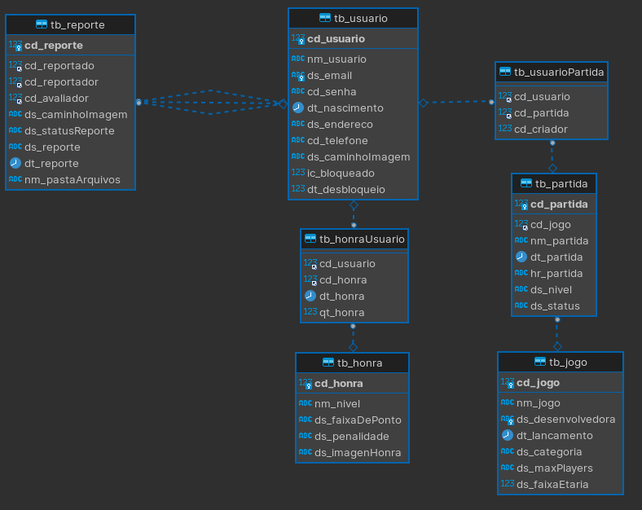

### Galeria de imagens

| |  |
| ------------ | ------------- |
| 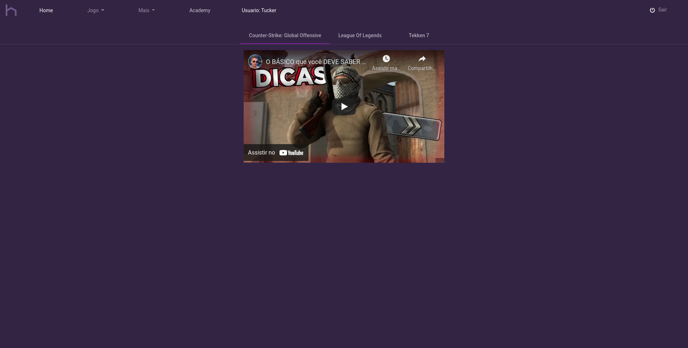 | 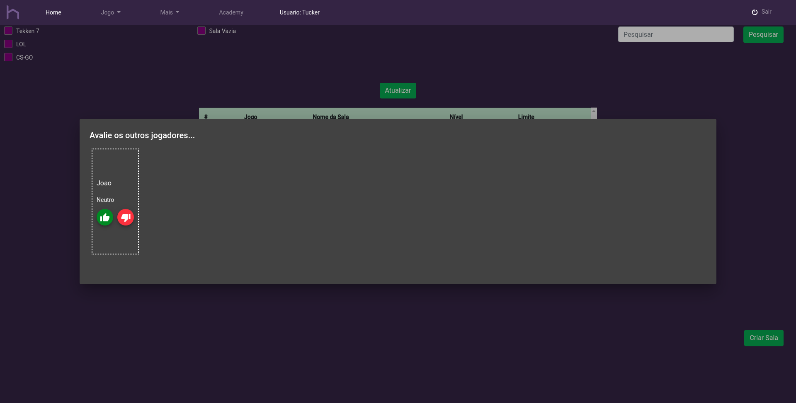
| 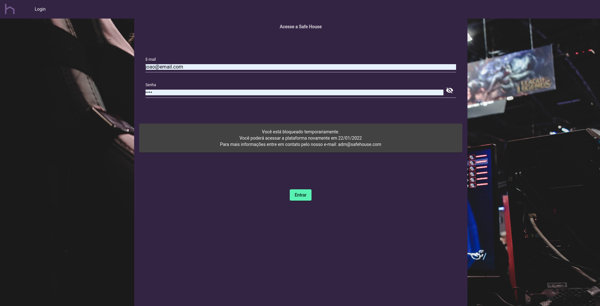 | 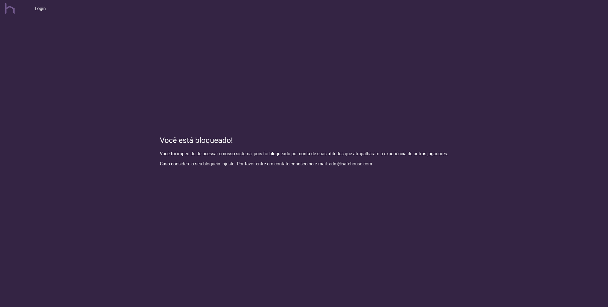
| 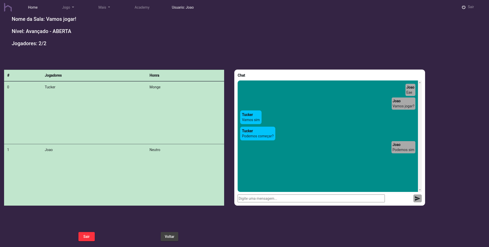 | 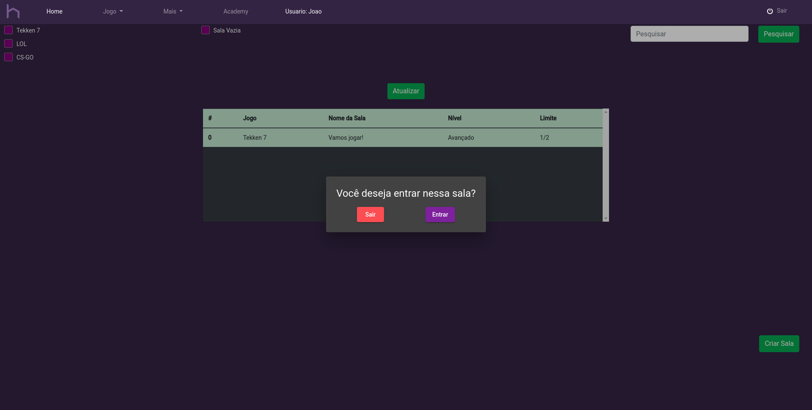
| 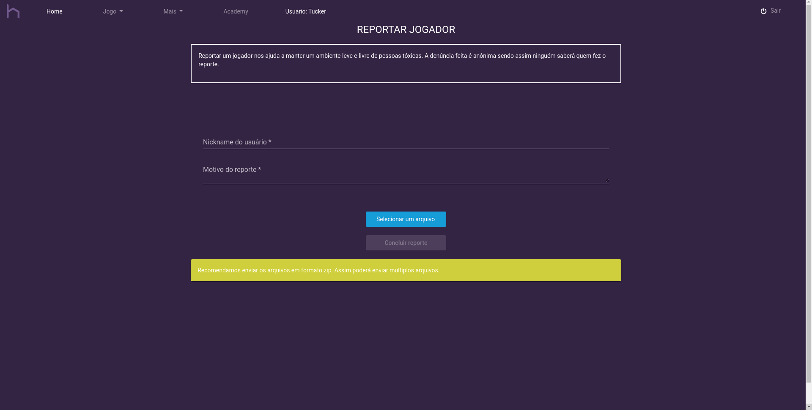 | 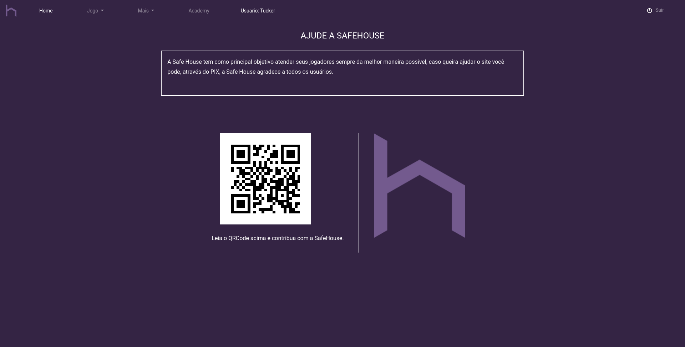
| 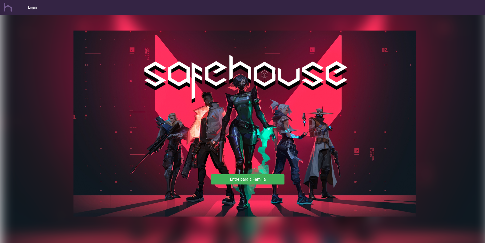 | 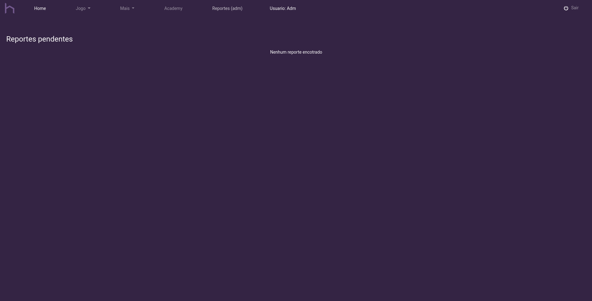
| 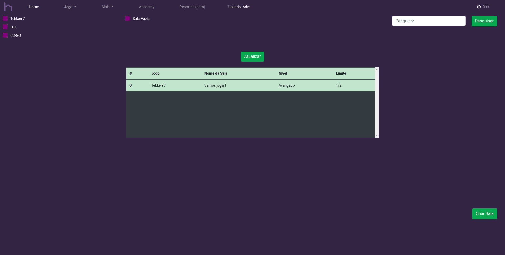 | 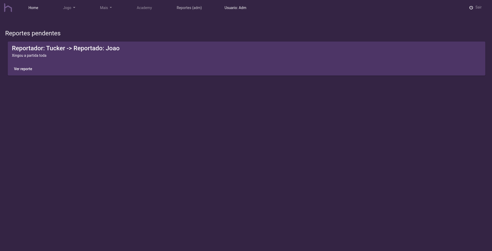
| 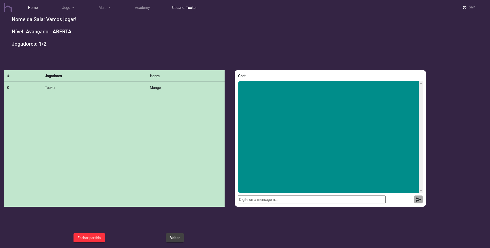 | 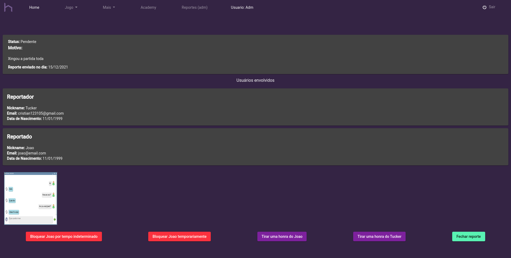

---

Made whit ❤️ by <strong><a href="http://cristuker.github.io" target="blank" >Cristian</>
</strong>
